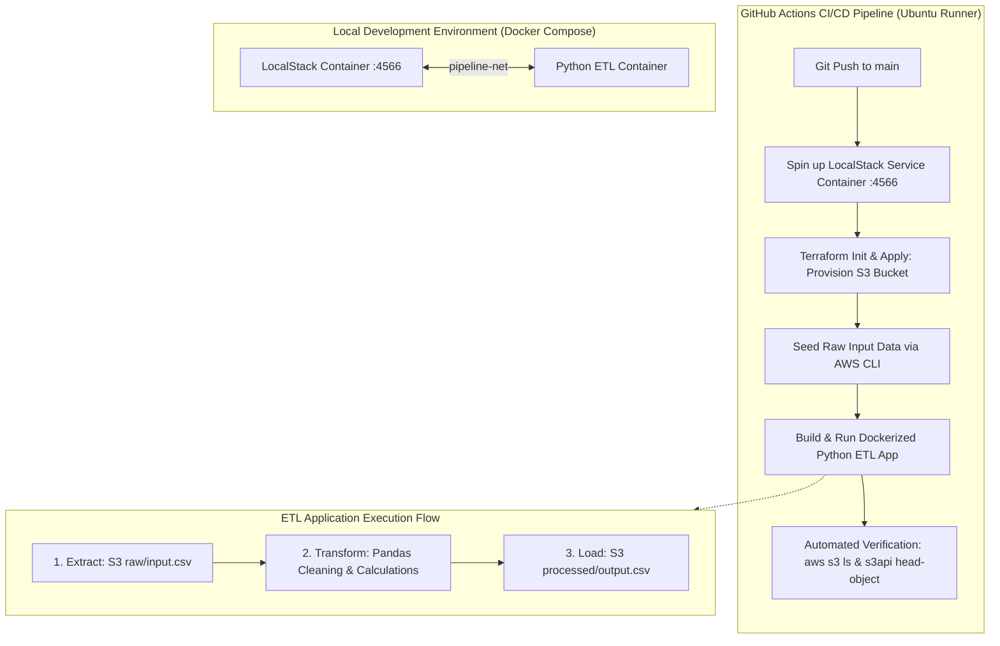
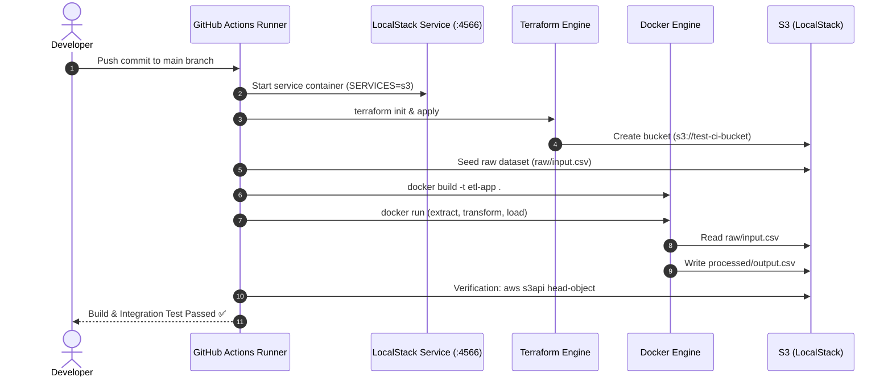

# Automated Data Pipeline Infrastructure with Terraform, Docker, and LocalStack

[](https://github.com/23A91A61D8/Automated-Data-Pipeline-Infrastructure-with-Terraform-Docker-and-LocalStack/actions/workflows/ci-pipeline.yml)
[](https://www.terraform.io/)
[](https://www.docker.com/)
[](https://localstack.cloud/)
[](https://www.python.org/)
[](https://pandas.pydata.org/)
[](LICENSE)

---

## Executive Summary & Objectives

The **Automated Data Pipeline Infrastructure** is an end-to-end DataOps and cloud infrastructure project bridging modern Data Engineering and DevOps. It demonstrates how to provision reproducible cloud resources using **Infrastructure as Code (IaC)**, package data extraction and transformation logic into **lightweight Docker containers**, emulate AWS cloud services locally using **LocalStack**, and orchestrate continuous integration and automated verification through **GitHub Actions**.

### Core Objectives
- **Zero-Cost Cloud Emulation**: Emulate AWS S3 entirely offline using LocalStack, eliminating cloud costs and credential exposure during development and testing.
- **Declarative Infrastructure as Code (IaC)**: Provision and manage cloud storage resources deterministically using Terraform.
- **Containerized Data Engineering**: Package Python ETL transformations (using Pandas and Boto3) into portable, layered Docker images.
- **Full CI/CD Pipeline Automation**: Automate infrastructure provisioning, test data seeding, ETL execution, and data validation upon every commit to the repository.

---

## Architecture Overview

The following diagram illustrates the interaction between components across local development and CI/CD environments.



### Architectural Component Breakdown

| Component | Technology | Primary Role in the Pipeline |
| :--- | :--- | :--- |
| **Infrastructure as Code** | **Terraform** (`hashicorp/aws`) | Declaratively provisions the S3 bucket (`aws_s3_bucket`) targeting the LocalStack emulator via custom endpoints. |
| **Cloud Emulation** | **LocalStack** | Intercepts AWS S3 API calls on port `4566`, providing an isolated, ephemeral sandbox for local and CI testing. |
| **ETL Application** | **Python (Pandas + Boto3)** | Reads raw CSVs from `raw/`, performs deduplication, filtering, and metric calculation, and writes to `processed/`. |
| **Containerization** | **Docker & Docker Compose** | Encapsulates dependencies and scripts into an immutable image with cached layer builds and bridge networking. |
| **CI/CD Orchestration** | **GitHub Actions** | Executes end-to-end integration testing in a GitHub-hosted runner with LocalStack service containers. |

---

## Repository Structure

```
.
├── .github/
│   └── workflows/
│       └── ci-pipeline.yml         # GitHub Actions automated CI/CD workflow
├── infrastructure/
│   ├── main.tf                     # AWS provider & S3 bucket resource definition
│   ├── variables.tf                # Parameterized input variables (region, bucket, endpoint)
│   └── outputs.tf                  # Exported Terraform outputs (bucket ID, ARN)
├── src/
│   ├── etl_script.py               # Core Python ETL extraction, transformation, & load logic
│   └── requirements.txt            # Pinned application dependencies (pandas, boto3, s3fs)
├── data/
│   └── sample_raw.csv              # Benchmark raw dataset for local testing
├── tests/
│   ├── __init__.py
│   └── test_etl.py                 # Unit tests for data transformation rules
├── scripts/
│   ├── setup_local.ps1             # One-click setup script for Windows (PowerShell)
│   └── setup_local.sh              # One-click setup script for Linux/macOS (Bash)
├── Dockerfile                      # Layer-cached Python container definition
├── .dockerignore                   # Build context exclusion rules
├── docker-compose.yml              # Local orchestration for LocalStack and ETL container
├── .env.example                    # Environment variable template
├── .gitignore                      # Git exclusion rules (Terraform state, credentials, caches)
└── README.md                       # Comprehensive project documentation
```

---

## Prerequisites

Before running the project locally, ensure you have the following installed:
- [Docker](https://docs.docker.com/get-started/) & [Docker Compose](https://docs.docker.com/compose/)
- [Terraform CLI](https://developer.hashicorp.com/terraform/downloads) (>= v1.0.0)
- [AWS CLI v2](https://aws.amazon.com/cli/) (used with `--endpoint-url`)
- [Python 3.10+](https://www.python.org/downloads/) (for running scripts/tests locally without Docker)

---

## Step-by-Step Local Setup & Execution

### 1. Clone the Repository & Configure Environment

```bash
git clone https://github.com/23A91A61D8/Automated-Data-Pipeline-Infrastructure-with-Terraform-Docker-and-LocalStack.git
cd Automated-Data-Pipeline-Infrastructure-with-Terraform-Docker-and-LocalStack

# Copy the environment variable template
cp .env.example .env
```

### 2. Launch LocalStack via Docker Compose

Start the LocalStack emulator container in detached mode:

```bash
docker-compose up -d localstack
```

Verify that LocalStack is running and the S3 edge port is available:
```bash
curl http://localhost:4566/_localstack/health
```

### 3. Provision the S3 Bucket with Terraform

Navigate to the `infrastructure/` folder, initialize Terraform, and apply the configuration:

```bash
cd infrastructure

# Initialize provider plugins
terraform init

# Plan and apply the infrastructure
terraform apply -auto-approve

# Return to repository root
cd ..
```

> **Note:** Terraform creates the S3 bucket defined in `variables.tf` (default: `my-pipeline-bucket`) inside the LocalStack instance.

### 4. Seed Raw Test Data into LocalStack S3

Upload the sample raw dataset to the `raw/` prefix in the provisioned bucket using the AWS CLI:

```bash
export AWS_ACCESS_KEY_ID=test
export AWS_SECRET_ACCESS_KEY=test
export AWS_DEFAULT_REGION=us-east-1

aws --endpoint-url=http://localhost:4566 s3 cp data/sample_raw.csv s3://my-pipeline-bucket/raw/input.csv
```

### 5. Build and Run the ETL Container

Use Docker Compose to build and execute the ETL pipeline:

```bash
# Build the Docker image
docker-compose build etl-app

# Execute the containerized ETL job
docker-compose run --rm etl-app
```

### 6. Verify Transformed Output Data

Assert that the ETL job produced the processed output file in S3:

```bash
# List contents of processed/ prefix
aws --endpoint-url=http://localhost:4566 s3 ls s3://my-pipeline-bucket/processed/

# Download and inspect the processed CSV
aws --endpoint-url=http://localhost:4566 s3 cp s3://my-pipeline-bucket/processed/output.csv -
```

---

## One-Click Local Automation

For convenience, ready-to-run automation scripts are provided for both Windows and Linux/macOS environments:

- **Windows PowerShell**:
  ```powershell
  .\scripts\setup_local.ps1
  ```

- **Linux / macOS Bash**:
  ```bash
  chmod +x ./scripts/setup_local.sh
  ./scripts/setup_local.sh
  ```

---

## CI/CD Pipeline Workflow (GitHub Actions)

The workflow defined in `.github/workflows/ci-pipeline.yml` executes automatically on every push or pull request to the `main` branch.



### Sequential Workflow Steps:
1. **LocalStack Service Container**: Starts `localstack/localstack:latest` alongside the runner with port `4566` bound to `localhost`.
2. **Terraform Provisioning**: Executes `terraform fmt -check`, `terraform init`, and `terraform apply -auto-approve` using environment variable overrides (`TF_VAR_s3_bucket_name=test-ci-bucket`).
3. **Data Ingestion**: Ingests benchmark CSV records into `s3://test-ci-bucket/raw/input.csv`.
4. **Container Build & Execution**: Builds the Docker image and executes it using `--network host` to interact directly with `localhost:4566`.
5. **Output Assertion**: Runs `aws s3api head-object` and downloads `processed/output.csv` to ensure data integrity and fail the build if the file is missing or corrupted.

---

## Running Unit Tests

Unit tests are included to validate the transformation logic, deduplication, and computed columns independently:

```bash
# Install dependencies
pip install -r src/requirements.txt pytest

# Execute unit test suite
pytest tests/ -v
```

---

## DataOps Best Practices & Key Design Decisions

1. **S3 Path-Style URLs (`s3_use_path_style = true`)**:
   - AWS S3 defaults to virtual-hosted style paths (`http://<bucket>.s3.amazonaws.com`).
   - Local environments cannot resolve arbitrary subdomains without local DNS modification.
   - Enforcing path-style URLs maps all requests to `http://localhost:4566/<bucket>`, ensuring 100% reliable local emulation.

2. **Bypassing AWS STS & Account ID Checks**:
   - Setting `skip_credentials_validation = true`, `skip_metadata_api_check = true`, and `skip_requesting_account_id = true` prevents Terraform from trying to connect to real AWS authentication endpoints.

3. **Docker Layer Caching**:
   - The `Dockerfile` copies `requirements.txt` and runs `pip install` before copying application code.
   - Any edits to `etl_script.py` build instantaneously in seconds by reusing cached dependency layers.

4. **Container Networking Parity**:
   - Within `docker-compose.yml`, services talk across the custom bridge network using the service name (`http://localstack:4566`).
   - In host mode (and GitHub Actions host networking), services connect via `http://localhost:4566`.
   - The Python script dynamically reads `AWS_ENDPOINT_URL` from the environment, ensuring zero hardcoding.

5. **No Real Secrets Committed**:
   - All configurations strictly use dummy credentials (`test`/`test`). No production keys or secrets are stored in the codebase.

---

## Troubleshooting & FAQ

#### Q: Why does the ETL container timeout when connecting to LocalStack in Docker Compose?
**A:** In Docker Compose, containers reside on an isolated bridge network. Use `http://localstack:4566` for `AWS_ENDPOINT_URL`. Using `localhost` will cause the container to query itself rather than the LocalStack service container.

#### Q: Why does Terraform report `InvalidClientTokenId` with dummy credentials?
**A:** Ensure `skip_credentials_validation = true` is present in the `provider "aws"` block in `main.tf`. This tells Terraform not to validate the token against AWS STS.

#### Q: Is data persisted if the LocalStack container stops?
**A:** By default, LocalStack is ephemeral. For integration testing and CI/CD pipelines, this ensures pristine test state every run.

---

## License

This project is licensed under the MIT License. See [LICENSE](LICENSE) for details.
